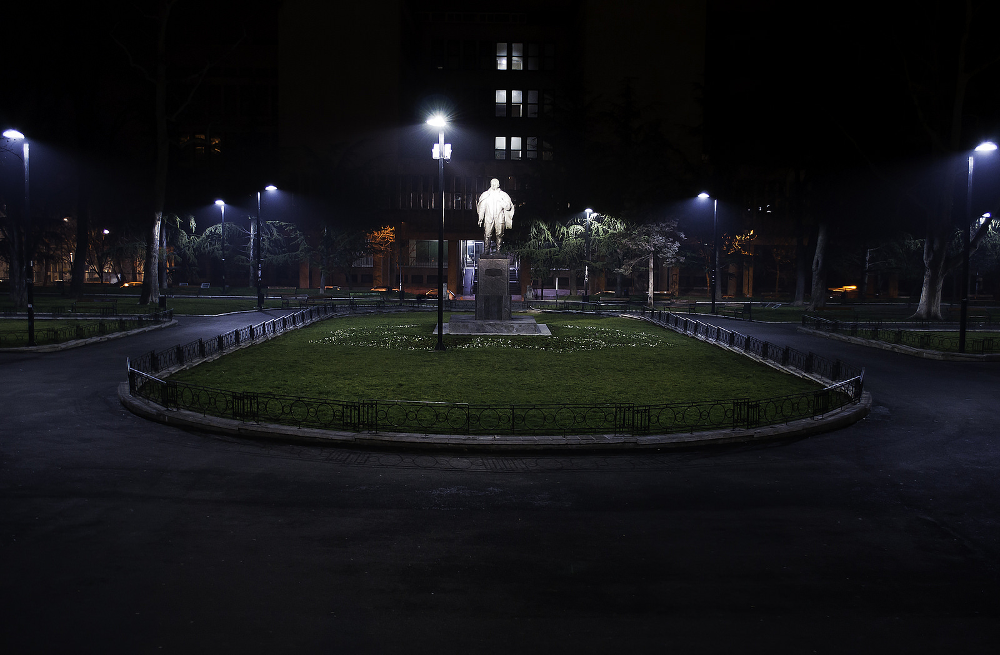
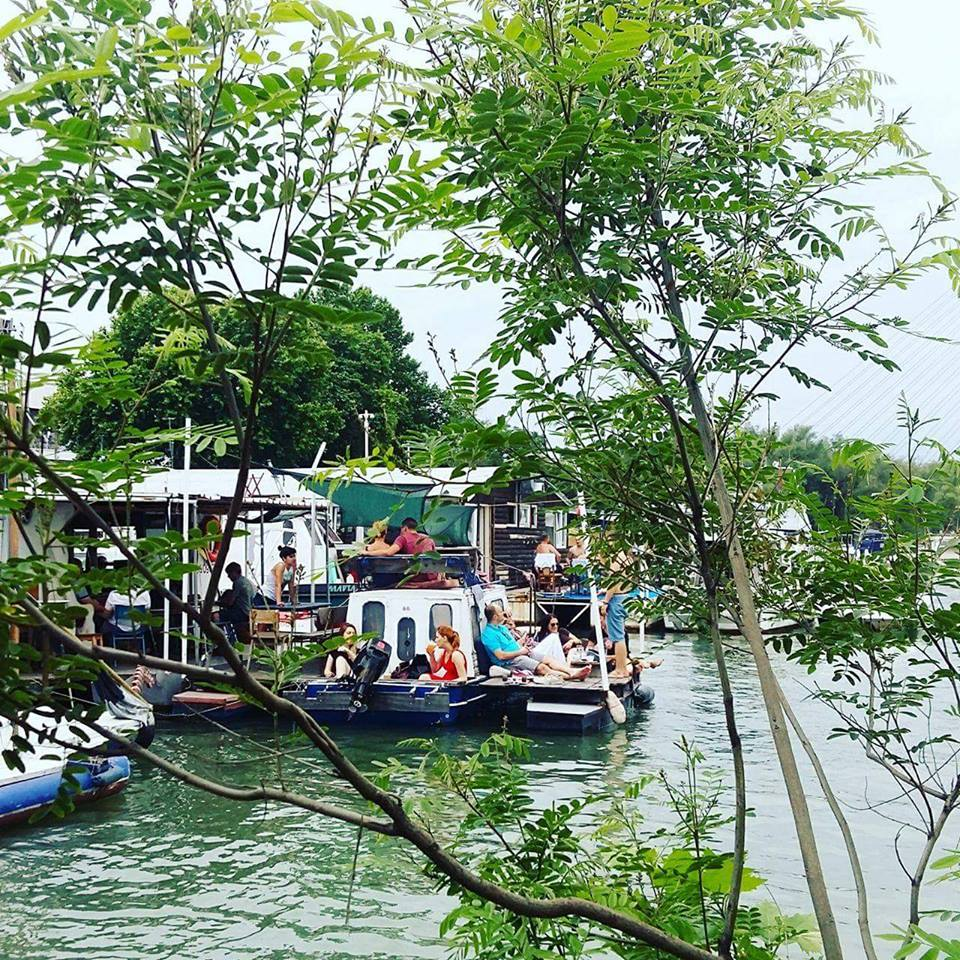

Did you survive the previous day? 
Maybe the soles of your feet are a bit worn-out, but the shoelaces are in place. 
Here are the notes of route number 2 after which you will smell like Belgrade for a long time.

**_Top notes  - Clubbing_**

If you want a first-hand experience of the Belgrade culture than make sure not to miss clubbing. Stop by the riverbanks of Sava and Danube where a lot of ''splav'' (floating river clubs) are waiting for you. The king of the underground clubbing is boat named [20/44](https://www.facebook.com/klub2044/) that has been on the ''best European small club'' list a few times in a row. Here, you will enjoy in the Lync-like interior and dance the night away whether it is techno, soul, house or funky night.

**_Middle notes  - Parks and recreations_**

Belgrade is full of a green spaces where you can take a break and enjoy your snacks. [Studentski park](https://en.wikipedia.org/wiki/Studentski_Trg) is one of the main rest area located in the heart of the city, across the University of Belgrade. Here, you can hop on the trolley (number 28) and get to the Botanical Garden [Jevremovac](https://en.wikipedia.org/wiki/Jevremovac)  which is a five-minute drive from park.  

**_Base notes - Cafes and restaurants_**

[Koffein](https://www.facebook.com/koffein.belgrade/) is a cool downtown place (Uskočka Street and Dušanova Street) with a great coffee and juice selection. Here, you will find delicious pastries and desserts as well. One of our personal favorite is boat-restaurant [Kurosava Ekskluziva](https://www.facebook.com/savakurosava/), Savski kej, behind the Belgrade Fair) where you can try one of the best pizza in town and chill at your very own boat - ''separe''.
For non-smokers and nature lovers, [Supernatural bar](https://www.facebook.com/supernaturalbar/) is a must! You should try their tomato juice, it's heavenly delicious. By comming to Supernatural you will be supporting education on ecology of Serbian youth since this place is marked under a category of social entrepreurship. It is located right below Studentski park, in th city center. 

